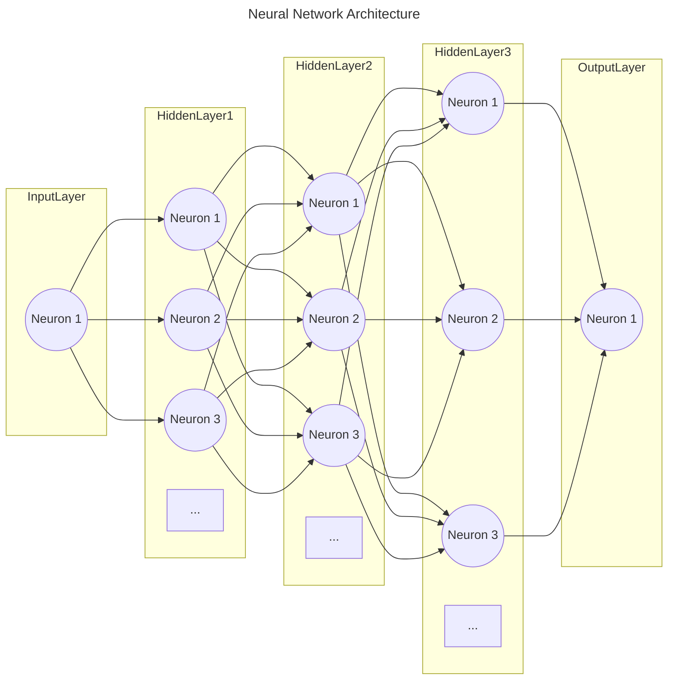
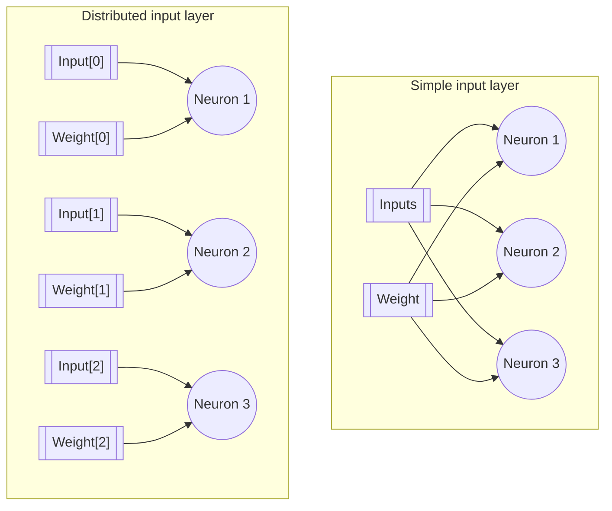
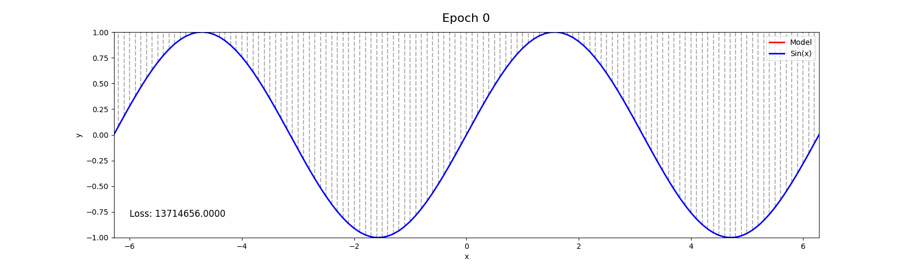

# Neural Network to Approximate the Sine Function
*Found the bug, the problem is the tf.version im using to develope the model. tf 2.15 on arm architecture works fine when using legacy.Adam, in other tf versions there are some issues with calculating the gradient. Later I will try to fix it but currently this works so its fine* :rocket:

## Introduction
This project implements a neural network from scratch to approximate the sine function. Unlike typical neural network implementations, this project does not use pre-built neural network functions from libraries like TensorFlow or PyTorch. Because the purpose of the project is building a neural network from scratch, the implementation includes the forward and backward propagation steps, as well as the training loop and the loss functions, the only built-in functions used are the tf matrix operations, activation functions and optimizers.

## Table of Contents
- [Overview](#overview)
- [Mathematics Behind Neurons](#mathematics-behind-neurons)
- [Implementation Details](#implementation-details)
    - [Network Architecture](#network-architecture)
        - [Input Layer](#input-layer)
        - [Hidden Layers](#hidden-layers)
        - [Output Layer](#output-layer)
    - [Loss Function](#loss-function)
    - [Accuracy Function](#accuracy-function)
- [Training the Network](#training-the-network)
- [Results](#results)
- [Usage](#usage)
- [References](#references)

## Overview

This project contains the following files:
- `NN_explanation.ipynb`: Explains the mathematics behind the neural network implementation, including the forward and backward propagation steps.
- `README.md`: This file.
- `Images/`: A folder containing images of the results and explanation resources.
- `scripts/`: A folder containing the python scripts for the project.
- `logs/`: A folder containing the logs of the training process and predictions at each epoch. 

## Mathematics Behind Neurons
I created a Jupyter notebook that explains the mathematics behind the neural network implementation, including the forward and backward propagation steps. You can access the notebook by clicking [here](NN_explanation.ipynb) I recommend reading this notebook before diving into the code because I explain the classes and functions in detail.

## Implementation Details
The neural network is implemented using the following classes:

Neuron: Represents a single neuron in the network.
Layer: Represents a layer consisting of multiple neurons.
Model: Represents the complete neural network model.

### Network Architecture
The network architecture consists of an input layer, hidden layers, and an output layer. Each layer contains neurons that apply weights, biases, and activation functions to the input data.
For this project, I choose to use a neural network with the following dense layers: [1, 512, 512, 512, 1], this architecture will be used for all the activation functions. The choosen optimizer is the Adam with a learning rate of 0.001.

#### Input Layer
The input layer directly takes the input data and passes it to the first hidden layer. Unlike other layers, the input layer does not apply any activation function, weights, or biases.

##### Why I distributed like this?
Because the input layer is just a placeholder for the input data, besides, this ensures that each input for the network will have it's own weight and bias when passed to the first hidden layer. Instead of having a single weight and bias for all the inputs. In the case the input dimensions $= 1$ this is not necessary, but it's a good practice to have it like this.

#### Hidden Layers
Each hidden layer consists of multiple neurons that apply a specified activation function, for the project we will be comparing the performance of the ReLU, Sigmoid and Hyperbolic Tangent activation functions.

#### Output Layer
The output layer consists of a single neuron that provides the final output of the network, It will be using the linear activation function.

### Loss Function
The loss function used for this project is the Residual Sum of Squares (RSS) loss function,The least squares approach chooses $\beta_0$ and $\beta_1$ to minimize the RSS. The RSS is a measure of the discrepancy between the data and the model's predicted values. The formula for the RSS is given by:

$$\text{RSS} = (y_1 - \hat \beta_0 - \hat \beta_1 x_1)^2 + (y_2 - \hat \beta_0 - \hat \beta_1 x_2)^2 + ... + (y_n - \hat \beta_0 - \hat \beta_1 x_n)^2$$

Or

$$RSS = \sum_{i=1}^{n} (y_i - f(x_i))^2$$

Why I choose this loss function? Because it's a simple loss function that can be used to compare the performance of the network with different activation functions, besides, it's a good loss function to use when the output is a continuous variable. (also to implement it from scratch is easier)

### Accuracy Function
I choose to use the $R^2$ statistic as the accuracy function, the
$R^2$ statistic provides an alternative measure of fit. It takes the form of *proportion*- the proportion of variance explained - and so it always takes on a value between 0 and 1, and is independent of the scale of $Y$
To calculate $R^2$, we use the formula    

$$R^2 = \frac{\text{TSS} - \text{RSS}}{\text{TSS}} = 1 - \frac{\text{RSS}}{\text{TSS}}$$

where $\text{TSS} = \sum_{i=1}^{n}(y_i - \hat{y})^2$ is the *total sum of squares*. *TSS* measures the total variance in the response $Y$, and can be thought of as the amount of variability inherent in the response before the regression is performed.

Why I choose this accuracy function? Because it's a good metric to use when the output is a continuous variable, besides, it's a good metric to use when comparing the performance of the network with different activation functions.

## Training the Network

## Results
The following images show the network's approximation of the sine function with the different activation functions compared to a baseline tf model.
You can see the comparison between the models on Wandb by clicking [here](https://wandb.ai/a01700257/Neural%20Network%20from%20scratch/table)  **(Note: The link will be available after the training is done)**

### ReLU Activation Function

### Sigmoid Activation Function

### Hyperbolic Tangent Activation Function

## Conclusion