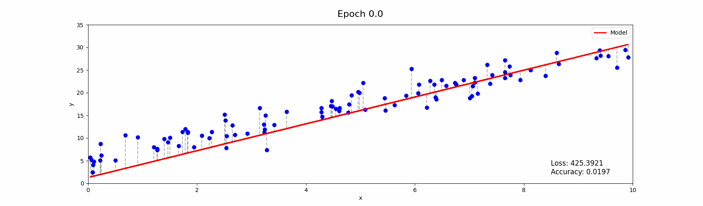

# Multiple Linear Regression for Predicting House Prices?

## Introduction

## Table of Contents
- [Overview](#overview)
- [Mathemathics behind Linear Regression](#mathemathics-behind-linear-regression)
- [Implementation Details](#implementation-details)
    - [Data Preprocessing](#data-preprocessing)
    - [Model Architecture](#model-architecture)
    - [Loss Function](#loss-function)
    - [Accuracy Function](#accuracy-function)
- [Training the Model](#training-the-network)
- [Results](#results)
- [Usage](#usage)
- [References](#references)

## Overview

## Mathemathics behind Linear Regression
I created a `Jupyter Notebook` to explain the mathemathics behind the linear regression. You can find the notebook [here](MLR_explanation.ipynb). It's easy to understand and I hope it will help you to understand the mathemathics behind the linear regression.
## Implementation Details
### Data Preprocessing
### Model Architecture
### Loss Function
### Accuracy Function
## Training the Model
## Results
## Usage
## References
